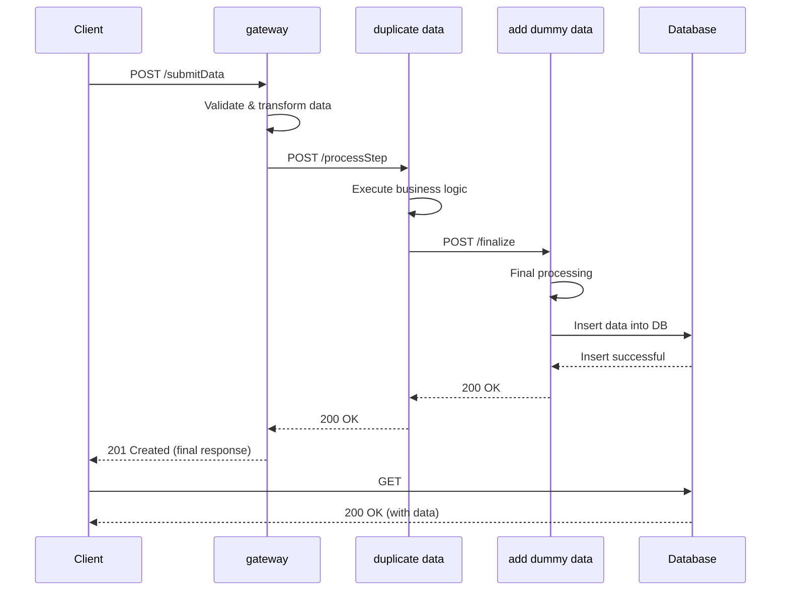

```mermaid
sequenceDiagram
    participant Client
    participant A as gateway
    participant B as duplicate data
    participant C as add dummy data
    participant DB as Database

    Client->>A: POST /submitData
    A->>A: Validate & transform data
    A->>B: POST /processStep
    B->>B: Execute business logic
    B->>C: POST /finalize
    C->>C: Final processing
    C->>DB: Insert data into DB
    DB-->>C: Insert successful
    C-->>B: 200 OK
    B-->>A: 200 OK
    A-->>Client: 201 Created (final response)

    Client->>DB: GET
    DB-->>Client: 200 OK (with data)
```